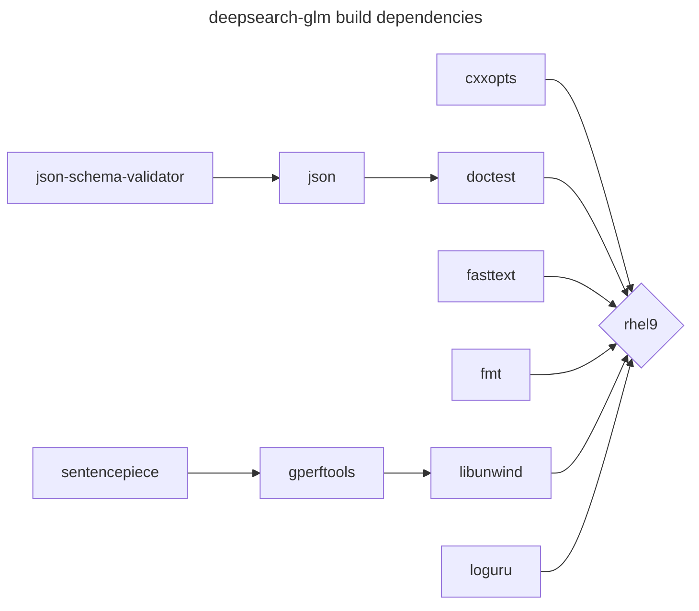
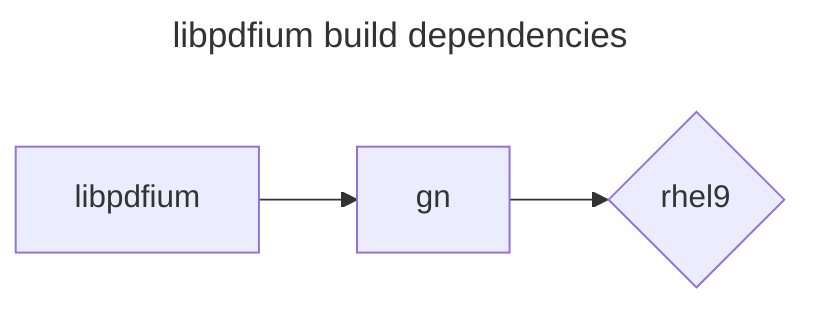
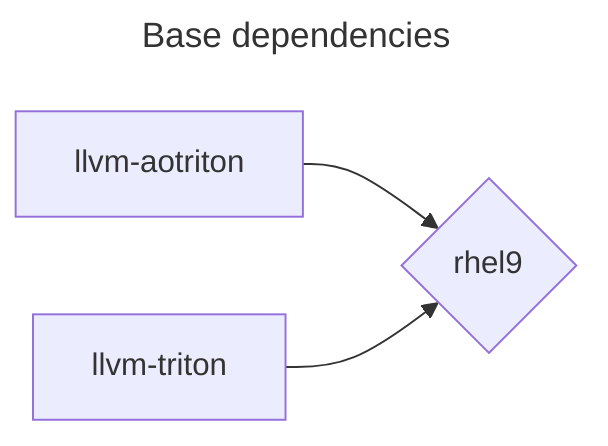
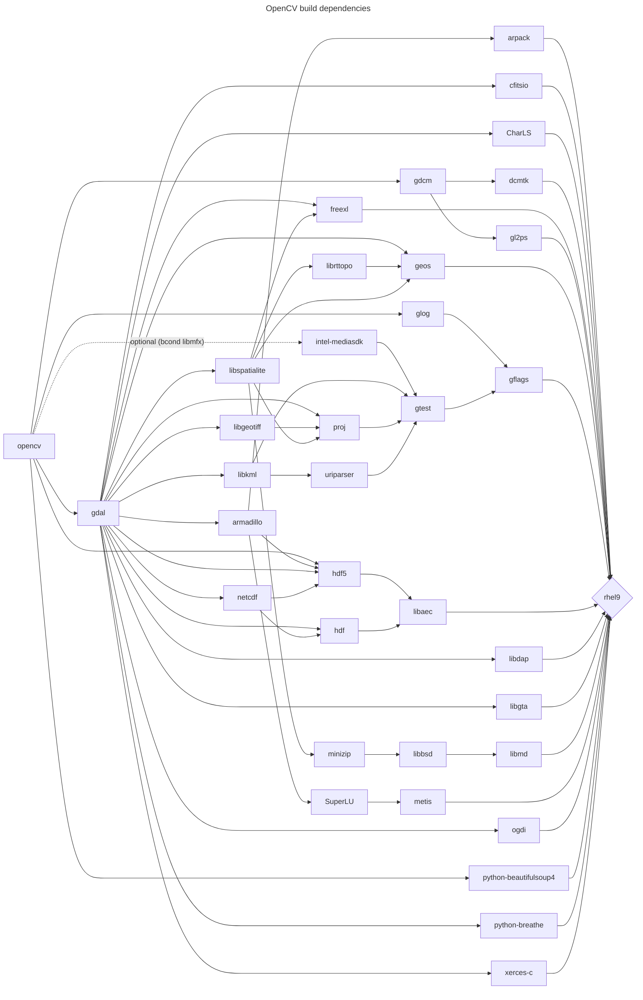
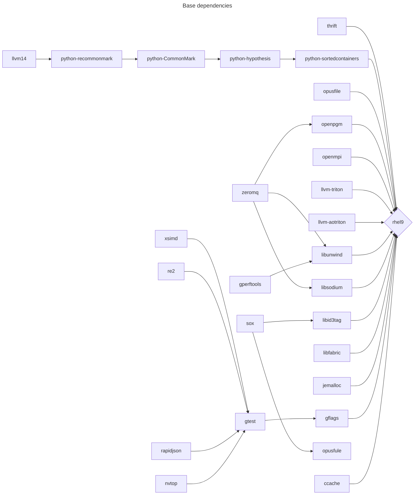

# Dependency trees

## deepsearch-glm

COPR [cheimes/deepsearch-glm](https://copr.fedorainfracloud.org/coprs/cheimes/deepsearch-glm/)

## libpdfium

COPR [cheimes/libpdfium](https://copr.fedorainfracloud.org/coprs/cheimes/libpdfium/)

## Triton LLVM

COPR [cheimes/llvm-triton](https://copr.fedorainfracloud.org/coprs/cheimes/llvm-triton)

## OpenCV

## Base

